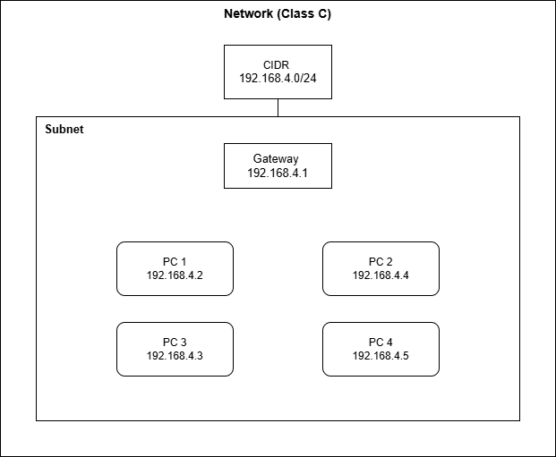

# Task 2 - Dumbways (Dennis Jason)

---

## 1. Diagram Jaringan Komputer

**Buat sebuah diagram sebuah jaringan komputer dengan 4 device dengan kondisi:**

- **IP Class C :** [192.168.4.xxx](http://192.168.4.xxx/)
- **CIDR Block :** 192.168.4.0/24

---

## 2. Perbedaan antara SH dan BASH

**Jelaskan perbedaan antara SH (Shell) dan BASH (Bourne-Again Shell)**

SH (Shell) dan BASH (Bourne-Again Shell) merupakan program berbasis linux/unix yang berfungsi menghubungkan user dengan sistem operasi. SH dan BASH memiliki perbedaan yaitu:

- SH hanya memiliki fitur basic sedangkan BASH memiliki fitur tambahan
- Ketika menggunakan SH memiliki tanda di terminal hanya ada tanda dollar sedangkan BASH ada nama user dan juga tanda dollar

---

## 3. Dokumentasi Command Linux

**Buat dokumentasi/kumpulan command linux yang kalian ketahui! (Command diluar materi akan diberi nilai ++)**

| **Command Linux** | **Fungsi** |
|---|---|
| `sudo` | Menggunakan super user / admin untuk menjalankan perintah |
| `apt` | Mengelola, menginstall dan mengupdate aplikasi atau package |
| `cd` | Pindah directory |
| `cp` | Mengcopy file |
| `mv` | Memindahkan file sekaligus memberi nama file |
| `cat` | Membaca isi file dan menampilkannya |
| `grep` | Mencari string pada file |
| `clear` | Menghapus semua yang terjadi di layar terminal |
| `echo` | Memantulkan atau menampilkan sebuah string ke layar |
| `chown` | Mengubah kepemilikan sebuah file atau folder |
| `chmod` | Mengubah permission sebuah file atau folder |
| `nano` | Membuka code editor nano bawaan linux |
| `mkdir` | Membuat folder baru |
| `touch` | Membuat file baru |
| `find` | Mencari file atau folder |
| `history` | Melihat riwayat perintah apa saja yang sudah kita jalankan |
