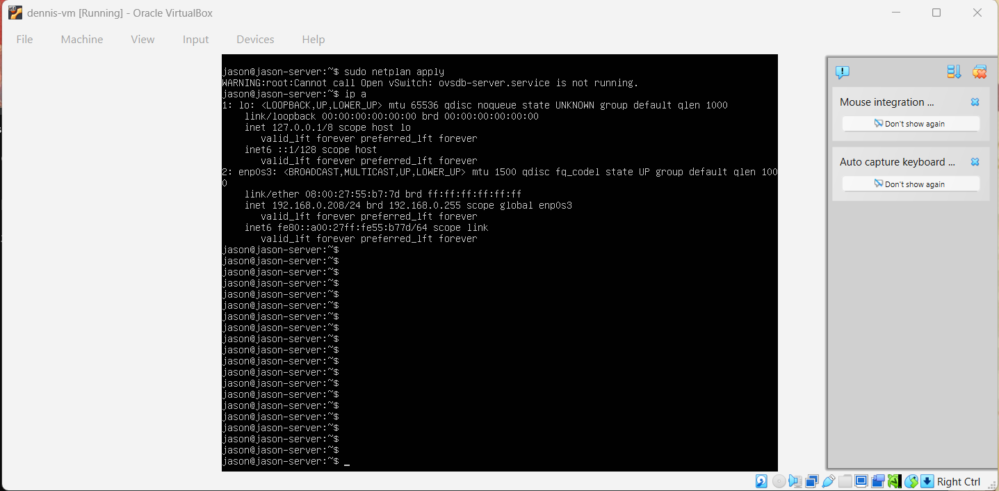
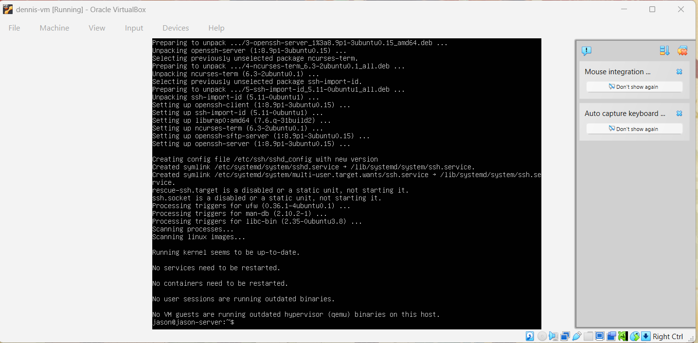
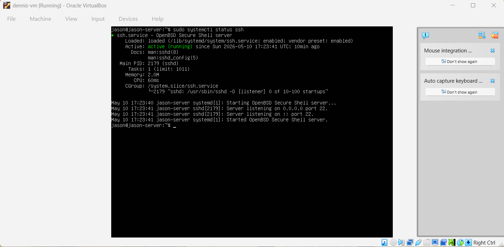
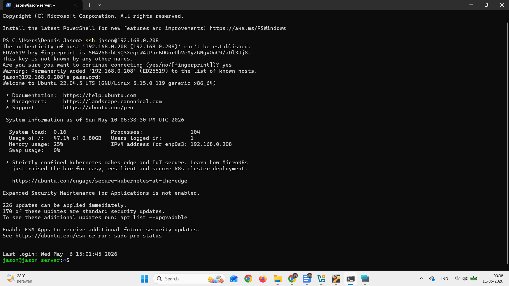
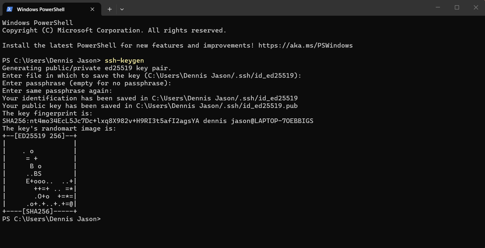
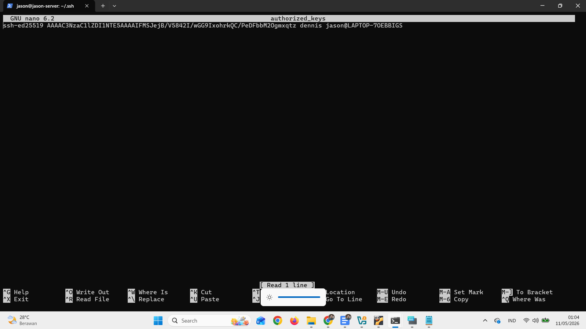
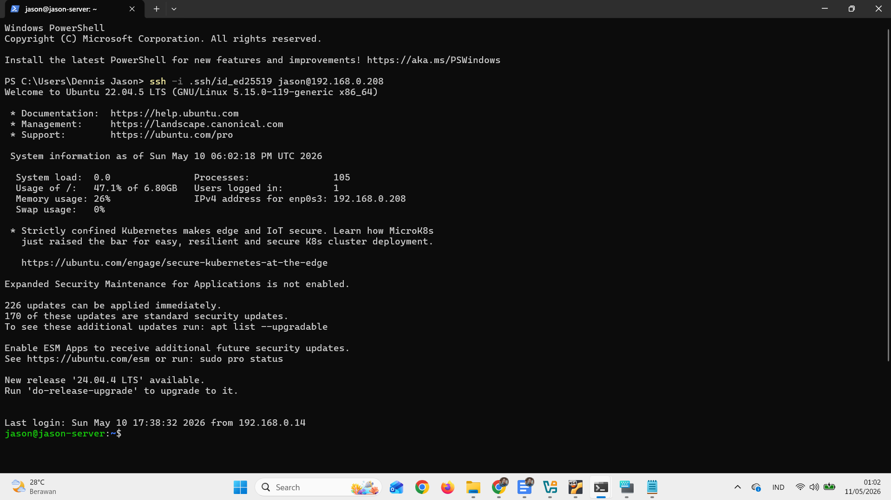
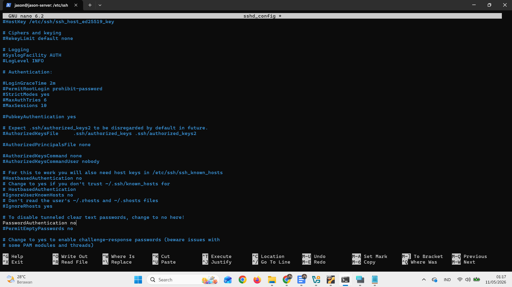
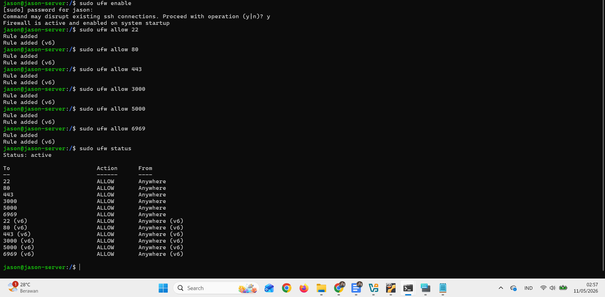

**1. Akses server menggunakan terminal (Windows Terminal/PuTTY/etc.)**

STEP 1: Cek IP server kita

STEP 2: Install openssh-server

STEP 3: Cek apakah openssh-server sudah berjalan

STEP 4: Lakukan di terminal "ssh jason@192.168.0.208"

**2. Konfigurasi ssh kalian agar bisa di akses *hanya menggunakan
publickey* (password opsional, bisa dimatikan)**

STEP 1: Generate key dengan ssh-keygen di pc kita (bukan di server)

STEP 2: Tambahkan key .pub pada file /etc/.ssh/authorized_keys di server
linux

STEP 3: Lakukan ssh tanpa password

STEP 4: Edit file /etc/ssh/sshd_config di server linux lalu simpan maka
sekarang hanya bisa ssh dengan key

**3. Buat step by step penggunaan text manipulation! (grep, sed, cat,
echo)**

-   **grep**

> **[mencari text pada file]{.underline}**
>
> 1\. touch file-grep
>
> 2\. nano file-grep (tulis "oke oke oce" lalu save)
>
> 3\. grep oce file-grep
>
> **[menghitung jumlah line yang berisi text yang kita
> cari]{.underline}**
>
> 1\. touch file-grep
>
> 2\. nano file-grep (tulis "oke oke oce" lalu save)
>
> 3\. grep -c oce file-grep
>
> **[mencari text pada semua file]{.underline}**
>
> 1\. touch file-grep
>
> 2\. nano file-grep (tulis "oke oke oce" lalu save)
>
> 3\. touch file-grep2
>
> 4\. nano file-grep2 (tulis "oce oce oke" lalu save)
>
> 5\. grep oce \*
>
> **[menghitung jumlah line yang berisi text yang kita cari di semua
> file]{.underline}**
>
> 1\. touch file-grep
>
> 2\. nano file-grep (tulis "oke oke oce" lalu save)
>
> 3\. touch file-grep2
>
> 4\. nano file-grep2 (tulis "oce oce oke" lalu save)
>
> 5\. grep -c oce \*

-   **sed**

> **[mengganti text di file]{.underline}**
>
> 1\. touch file-sed
>
> 2\. nano file-sed (tulis "hallo hallo apa kabar?" lalu save)
>
> 3\. sed -i 's/hallo/hai/g' file-sed
>
> 4\. cat file-sed (menampilkan "hai hai apa kabar?")

-   **cat**

> **[membaca file]{.underline}**
>
> 1\. touch file1
>
> 2\. nano file1 (tulis "hallo" lalu save)
>
> 3\. cat file1 (menampilkan isi file)
>
> **[membuat file dengan isi text]{.underline}**
>
> 1\. cat \> file2
>
> 2\. ketik "apa kabar ?"
>
> 3\. lalu enter
>
> **[membuat file dan mengisinya dengan isi text dari file
> lain]{.underline}**
>
> 1\. cat file1 file2 \> file3
>
> 2\. cat file3 (tampil isi file1 dan file2)

-   **echo**

> **[mencetak text ke layar]{.underline}**
>
> 1\. echo "hello world"
>
> **[membuat file dengan isi text]{.underline}**
>
> 1\. echo "hello world" \> file-echo
>
> **[menambahkan isi file yang sudah ada]{.underline}**
>
> 1\. echo "hello world" \> file-echo
>
> 2\. echo "hello world 2" \>\> file-echo
>
> **[mereplace semua isi file dengan text baru]{.underline}**
>
> 1\. echo "hello world" \> file-echo
>
> 2\. echo "hello world 2" \>\> file-echo
>
> 3\. echo "oke oce" \> file-echo

**4. Nyalakan ufw dengan memberikan akses untuk port 22, 80, 443, 3000,
5000 dan 6969!**

