# Task Day 4 - Dennis Jason

## 1. Penjelasan tentang git

Git adalah version control system untuk mengelola perubahan pada kode

---

## 2. Buat sebuah repositori bernama "devops26-dumbways-\<nama\>", lalu tambahkan 3 file yang berisi text

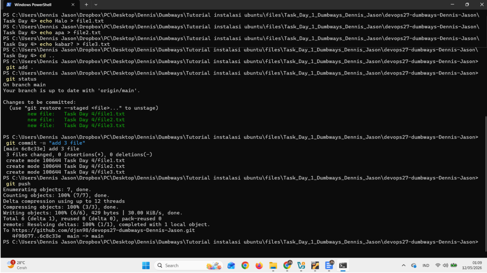

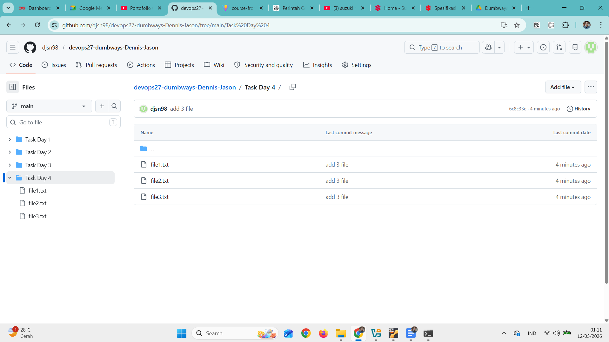

---

## 3. Manage repository tugas kalian menggunakan terminal!

- **Clone repository dari github**

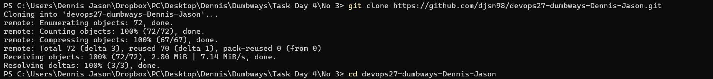

- **Menambah commit baru dengan mengedit file**

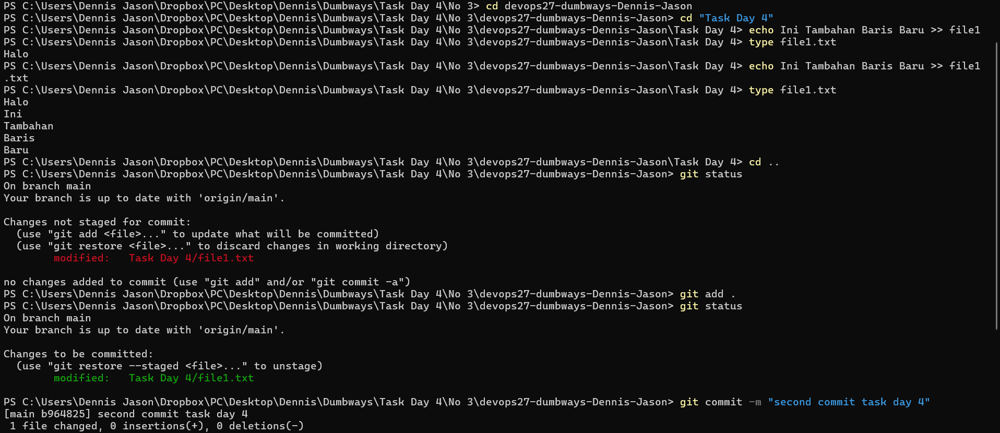

- **Push commit ke github**

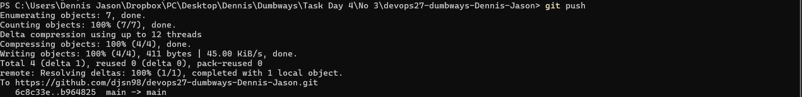

- **Membuat branch baru**

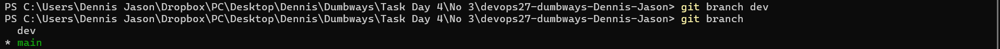

- **Pindah branch**

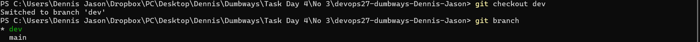

---

## 4. Demokan cara untuk mencari perubahan text pada suatu file di GitHub!

**STEP 1:** Buka repository di github

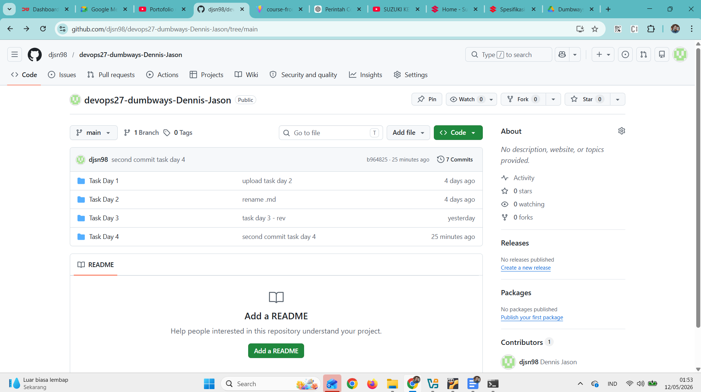

**STEP 2:** Pilih branch

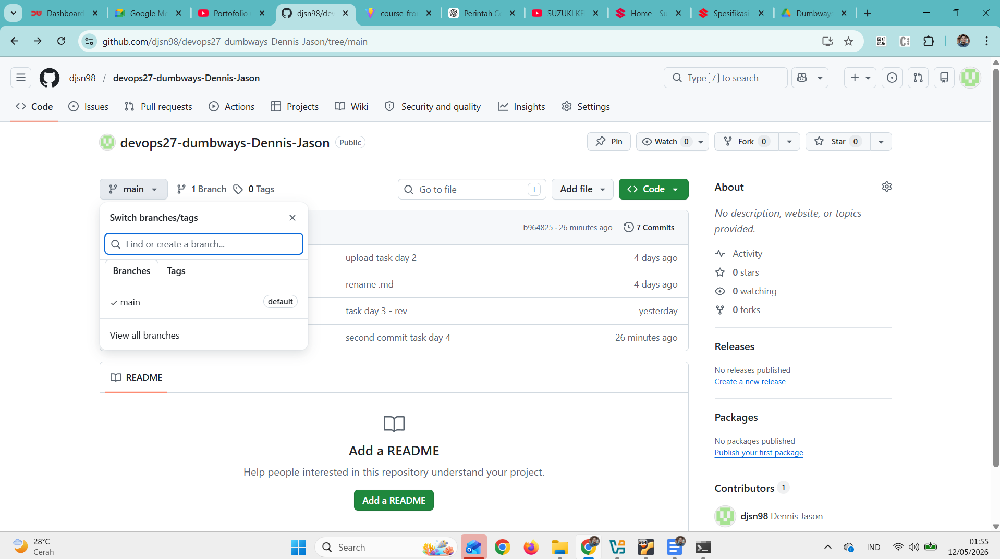

**STEP 3:** Klik "Commits"

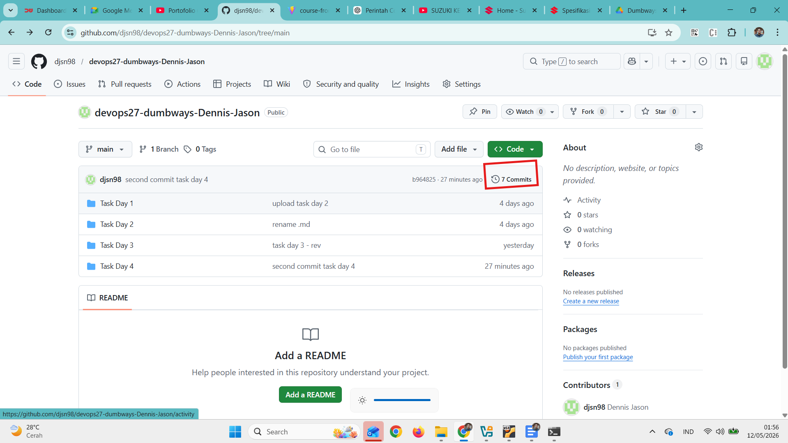

**STEP 4:** Pilih commit

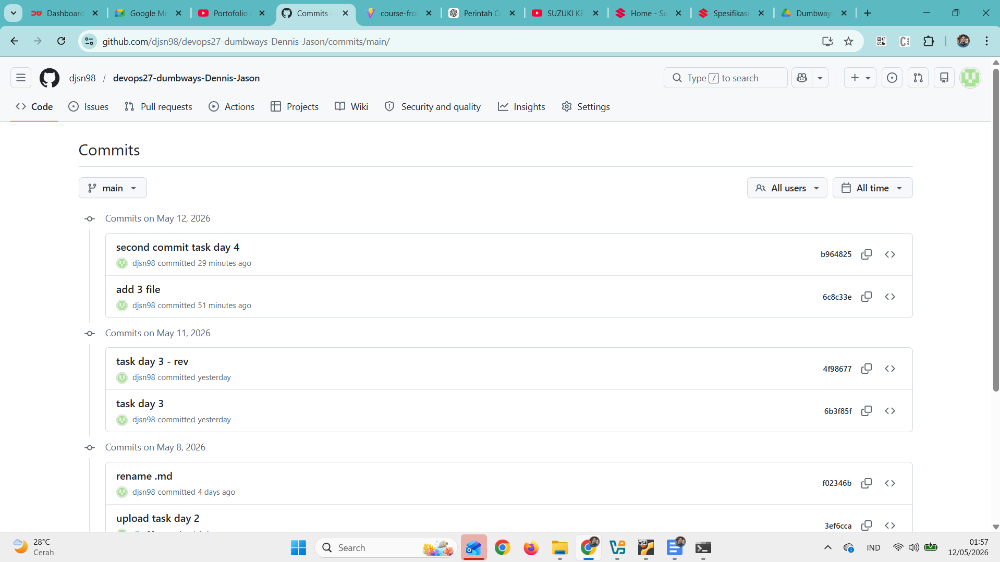

**STEP 5:** Lihat perubahan kode

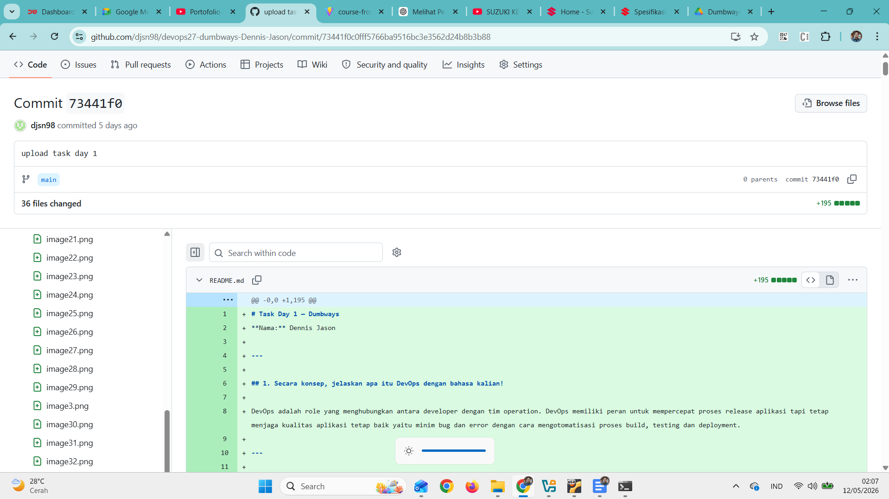
