1. NodeJS

- Deploy app wayshub-frontend

- Berjalan di port 3000

- Menggunakan NodeJS 10 & 12

[https://github.com/dumbwaysdev/wayshub-frontend](https://github.com/dumbwaysdev/wayshub-frontend)

Jawab:

STEP 1: Install nvm 12 untuk menggunakan nodejs 12

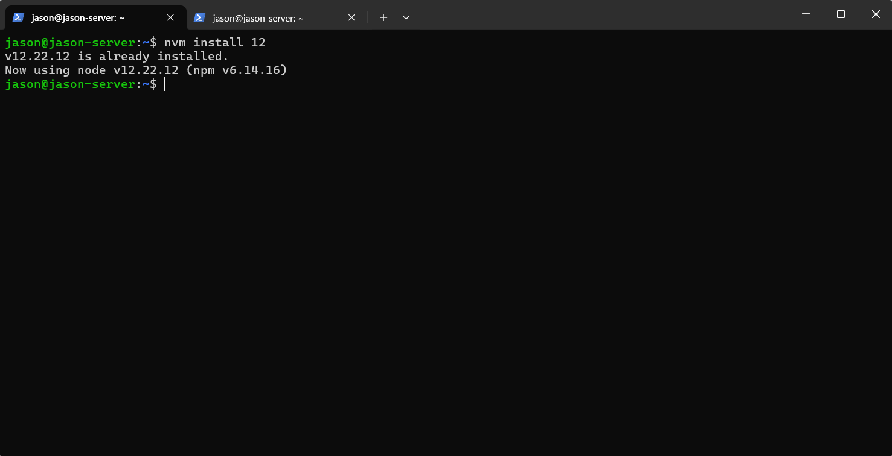

STEP 2: Clone repository

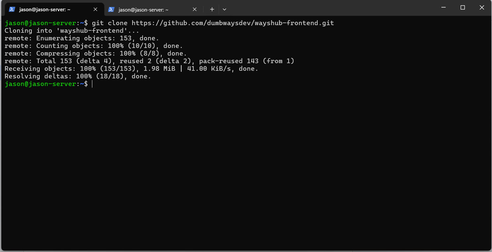

STEP 3: Install yarn dan cek versinya

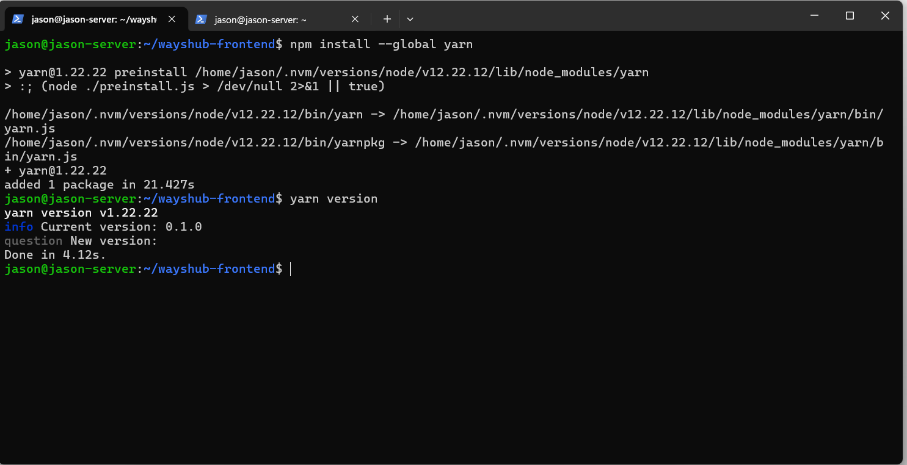

STEP 4: Install dependency dengan yarn

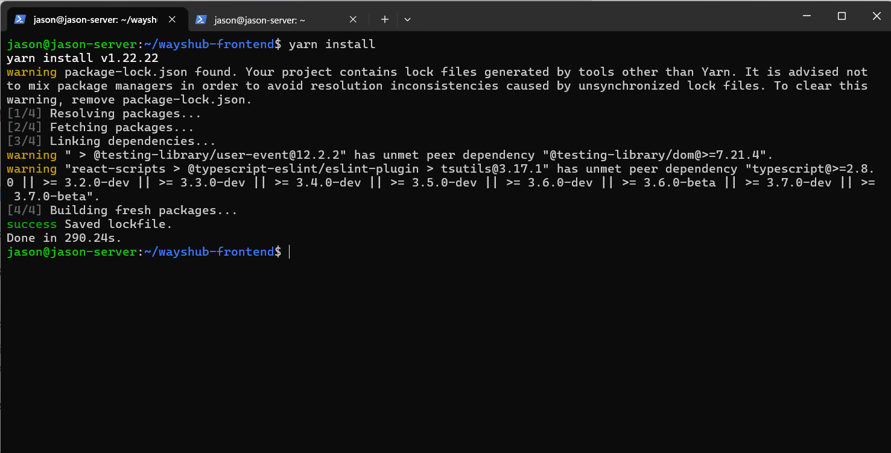

STEP 5: Jalankan aplikasi dengan perintah "yarn start"

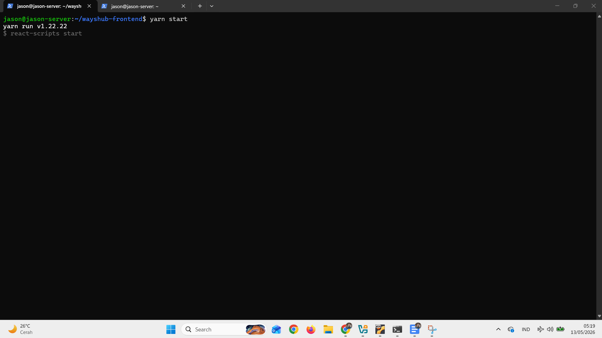

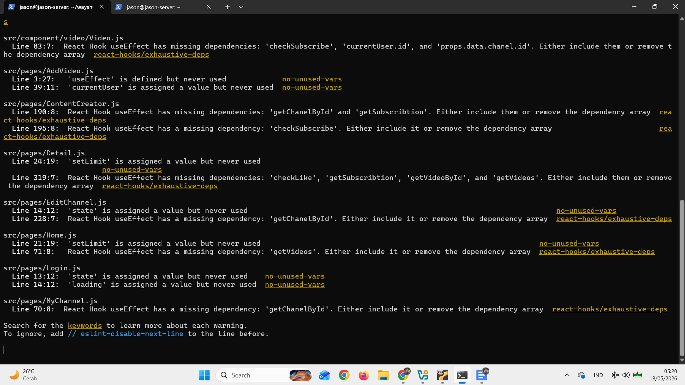

STEP 6: Buka localhost:3000

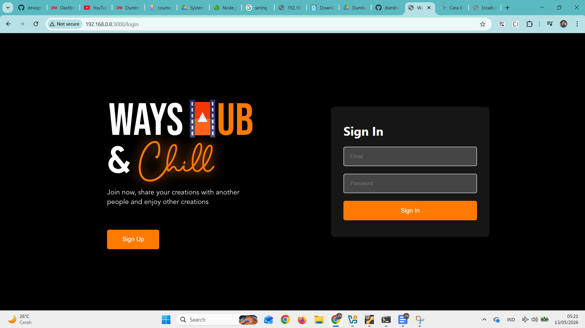

2. Python

- Deploy app menampilkan text nama kalian!

- Berjalan di port 5000 & bisa dibuka melalui web

Jawab:

STEP 1: Install package flask

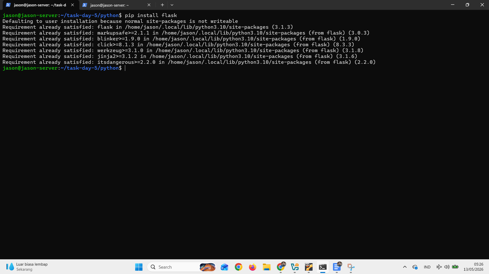

STEP 2: buat kode python lalu simpan

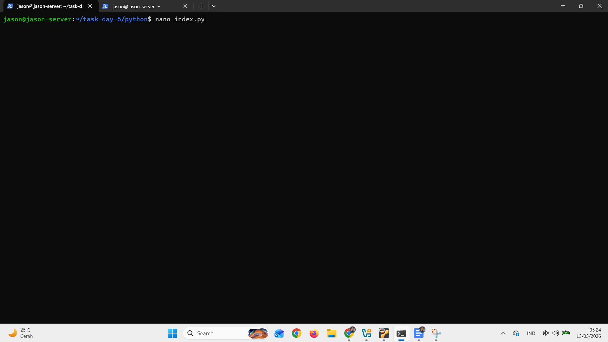

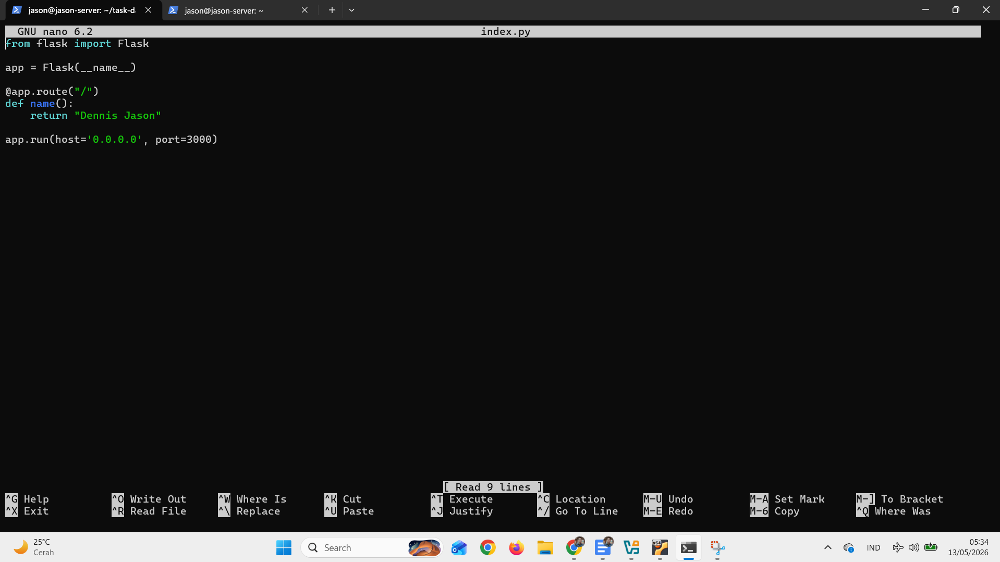

STEP 4: Jalankan aplikasi dengan perintah

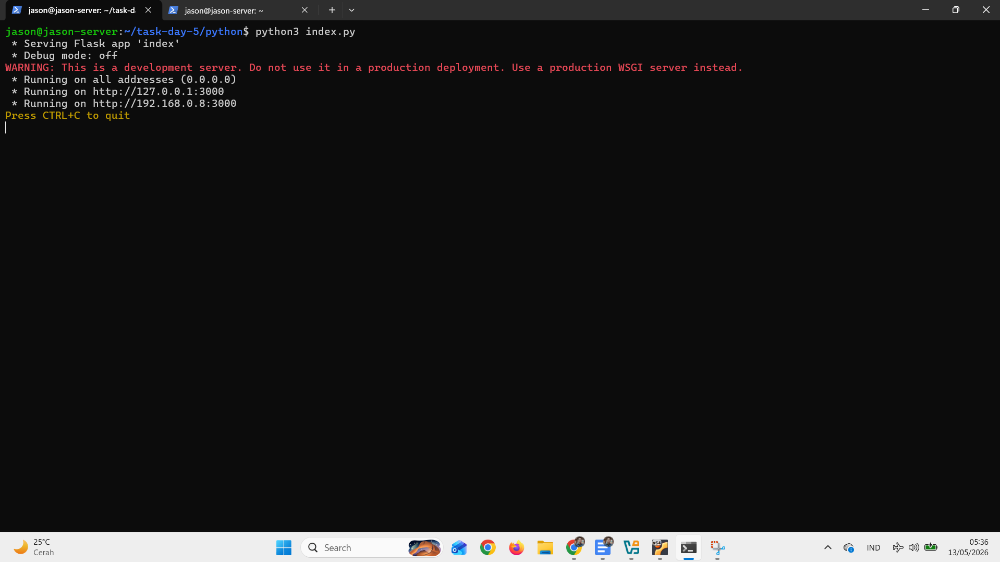

STEP 5: Buka di browser "192.168.0.8:3000"

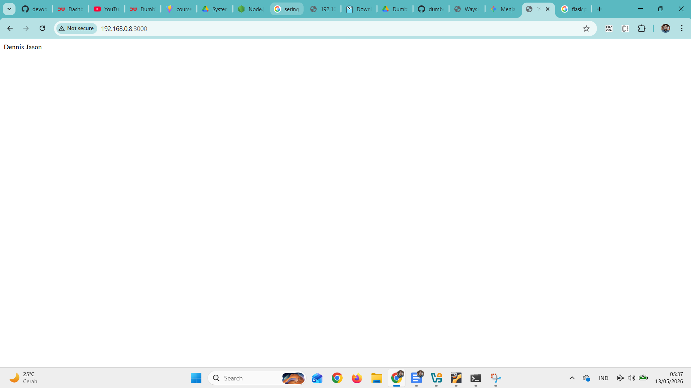

3. Golang

- Deploy app menampilkan text "Golang geming!"

Jawab:

STEP 1: Buat kode golang dan simpan

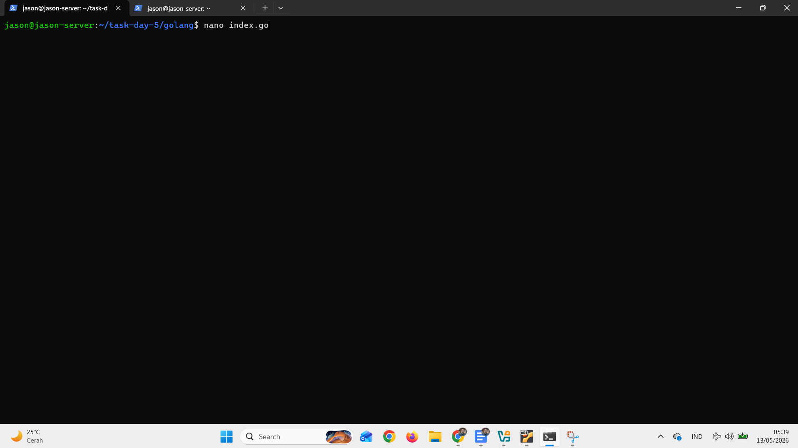

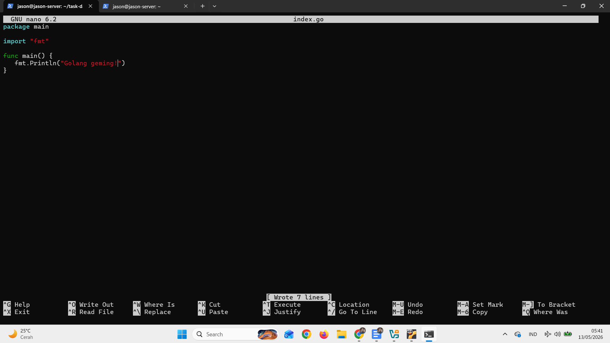

STEP 2: Jalankan kode program

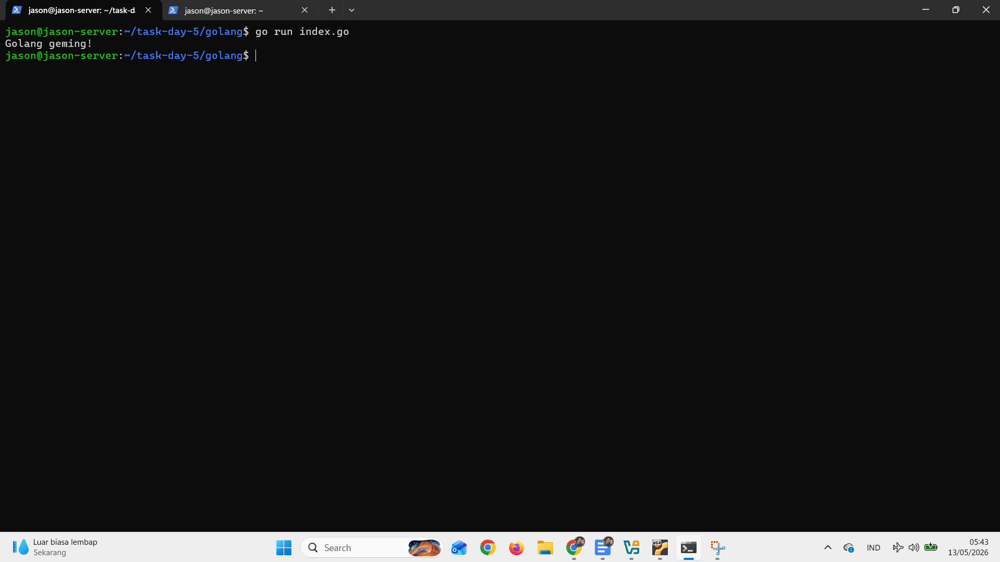

**Note** : Semua app WAJIB bisa diakses dengan **UFW enabled** (firewall
menyala abangkuh 🔥🔥🔥)

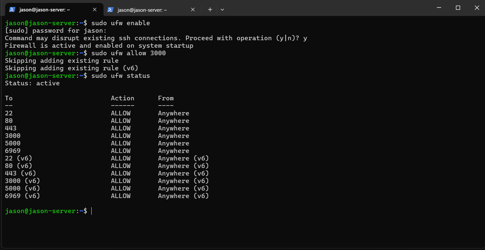
