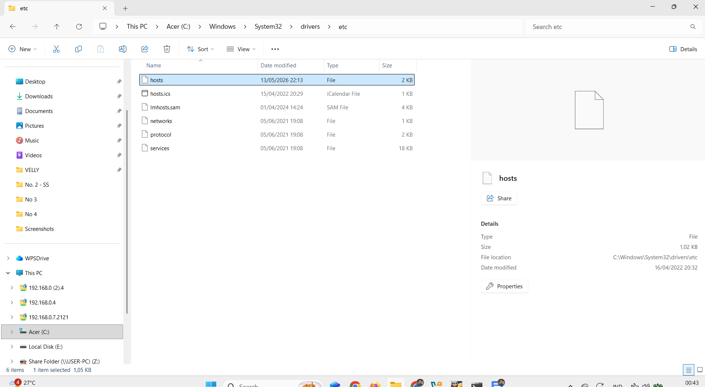
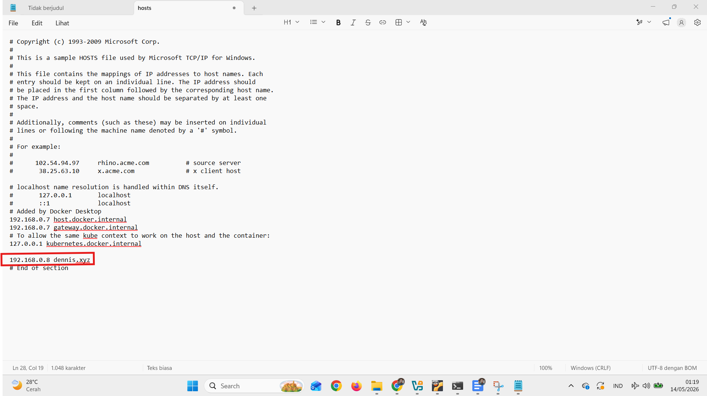
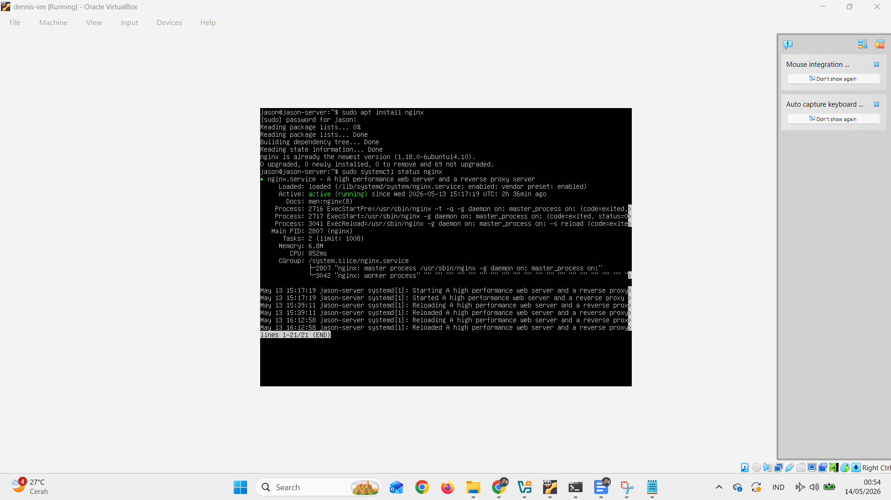
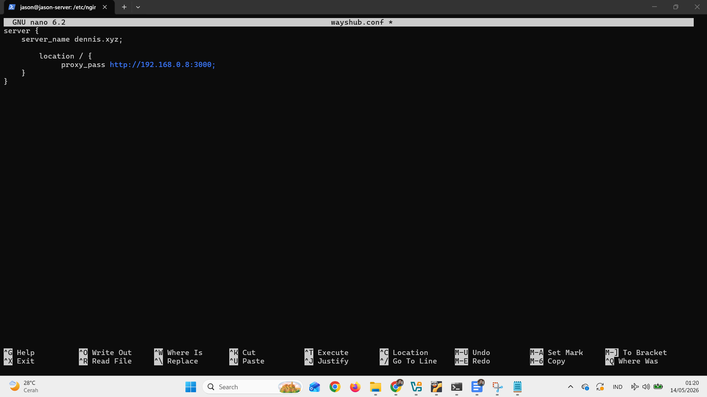
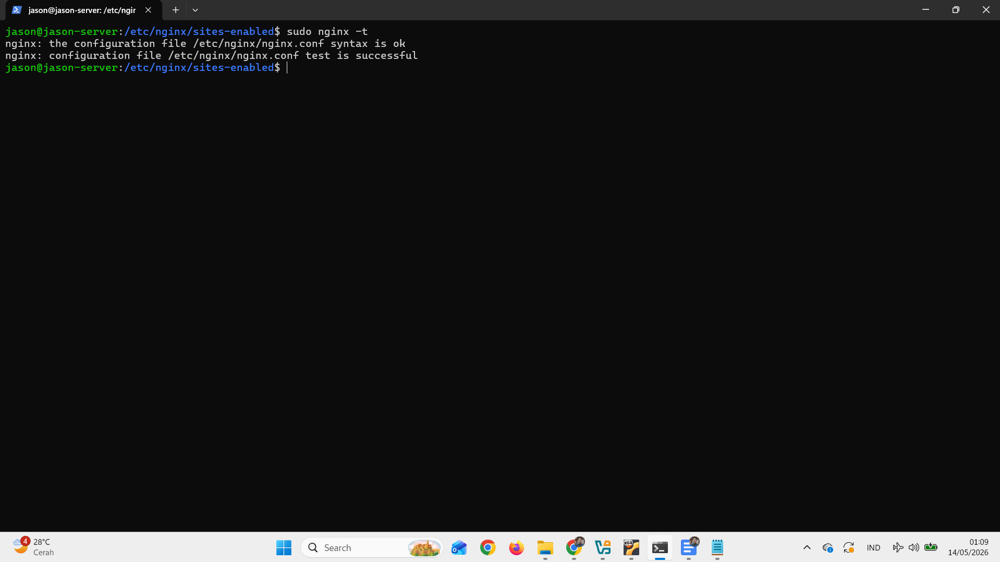
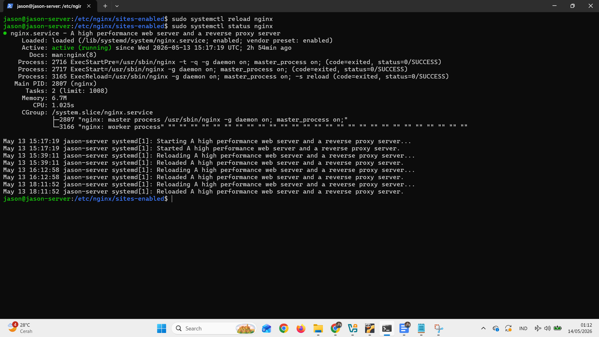
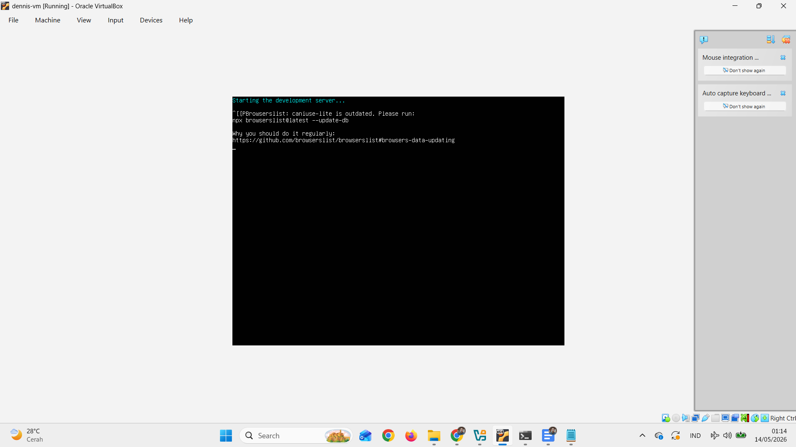
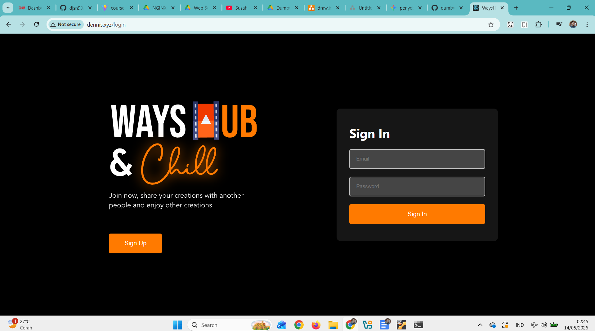

**1. Gambarkan sturktur web server menggunakan reverse proxy dan
jelaskan cara kerjanya!**

Jawab:

{width="6.260416666666667in"
height="0.9791666666666666in"}

Client mengirim request diterima server reserve proxy lalu diteruskan ke
web server dan web server meneruskan ke aplikasi lalu aplikasi menerima
data request dan kemudian diproses dan bisa juga mengakses data di
database. Lalu aplikasi memberikan output ke web server lalu web server
mengirim response ke reverse proxy server dan diteruskan ke client.

Reverse proxy server berfungsi sebagai perantara untuk terhubung ke
client melalui jaringan (internet)

**2. Buatlah Reverse Proxy untuk aplilkasi yang sudah kalian deploy
kemarin. (wayshub), untuk domain nya sesuaikan nama masing\" ex:
[[ade.xyz]{.underline}](http://ade.xyz/) .**

Jawab:

STEP 1: Buka file C:\\Windows\\System32\\drivers\\etc di PC kita

{width="5.953125546806649in"
height="3.2732294400699913in"}

STEP 2: Edit file C:\\Windows\\System32\\drivers\\etc di PC kita dengan
menambahkan IP dan nama domain

{width="5.963542213473316in"
height="3.3313582677165354in"}

STEP 3: Install nginx dan cek apakah sudah berjalan pada linux server

{width="5.994792213473316in"
height="3.370206692913386in"}

STEP 4: Tambahkan file wayshub.conf pada directory
/etc/nginx/sites-enabled yang berisi :

{width="6.267716535433071in"
height="3.5277777777777777in"}

STEP 5: Cek apakah file wayshub.conf sudah benar

{width="6.267716535433071in"
height="3.5277777777777777in"}

STEP 6: Reload nginx dan cek apaka aplikasi masih nyala

{width="6.267716535433071in"
height="3.5277777777777777in"}

STEP 7: Jalankan aplikasi wayshub

{width="6.267716535433071in"
height="3.5277777777777777in"}

STEP 8: Buka di browser aplikasinya dengan domain
[[dennis.xyz]{.underline}](http://dennis.xyz)

{width="6.267716535433071in"
height="3.5in"}
