**TASK WEEK 1**

1.  **Deploy Mysql**

> STEP 1 : Menyalakan server Appserver-1
>
> 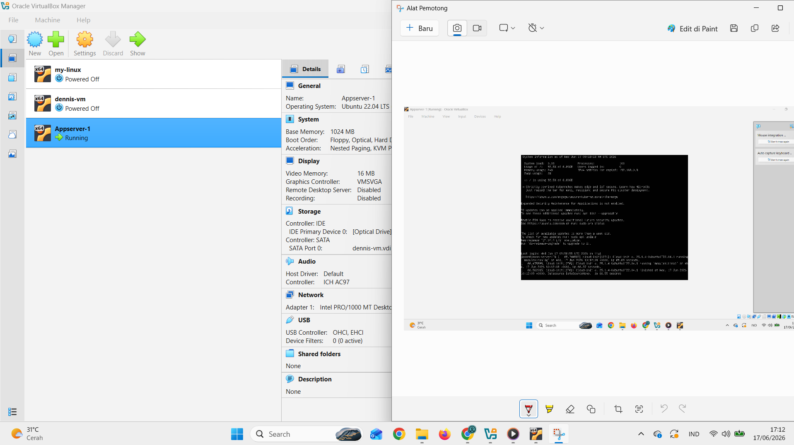{width="4.369792213473316in"
> height="2.4624846894138233in"}
>
> STEP 2 : Buat user baru untuk server
>
> 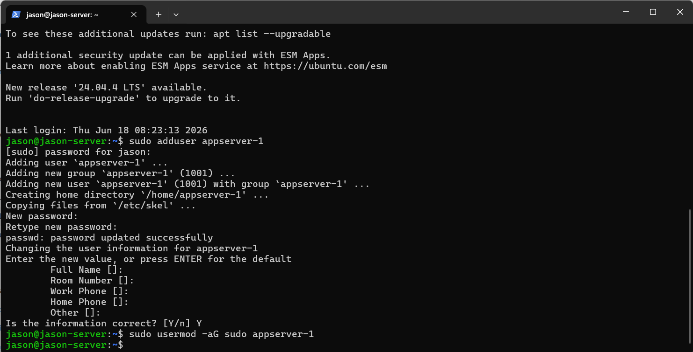{width="4.505208880139983in"
> height="2.2919510061242345in"}
>
> STEP 3 : Setup agar dapat melakukan ssh tanpa pasword dengan ssh key
>
> 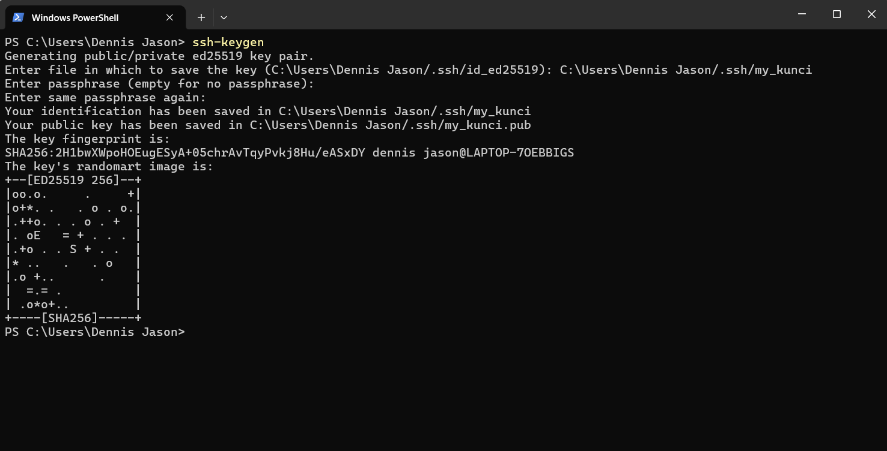{width="4.632490157480315in"
> height="2.3647025371828523in"}
>
> 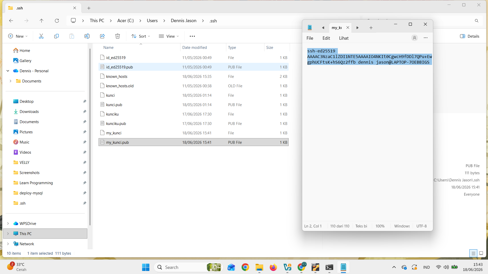{width="4.755208880139983in"
> height="2.6777668416447944in"}
>
> {width="4.723958880139983in"
> height="2.4247561242344706in"}
>
> STEP 4 : Ssh tanpa password
>
> {width="4.703125546806649in"
> height="2.6484372265966756in"}
>
> STEP 5 : Lakukan sudo apt update\
> 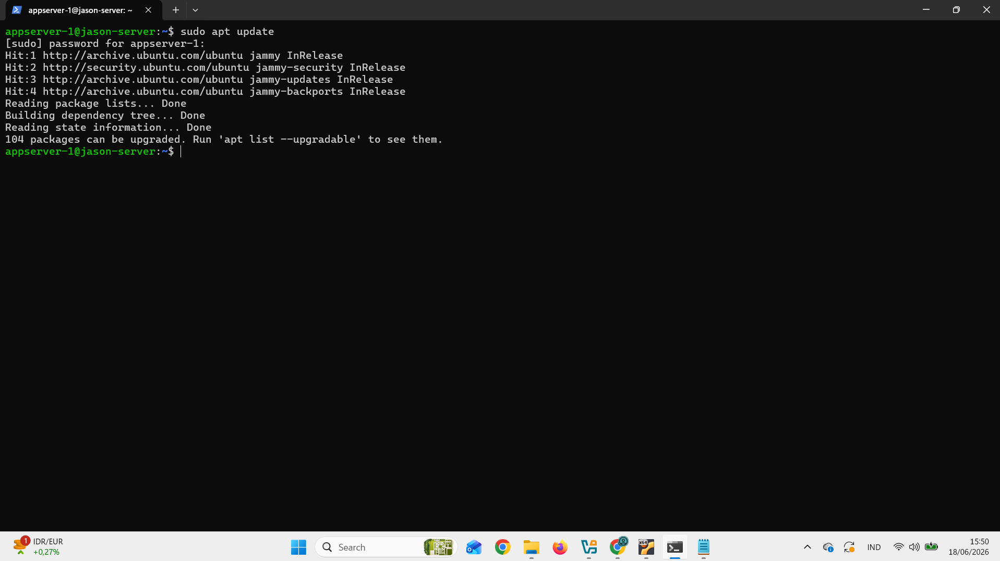{width="4.817708880139983in"
> height="2.7124912510936134in"}
>
> STEP 6 : Menginstall mysql server
>
> {width="4.848958880139983in"
> height="2.730559930008749in"}
>
> STEP 7 : Cek apakah Mysql sudah berjalan

{width="4.880208880139983in"
height="2.750117016622922in"}

STEP 8 : Masuk ke MySql

{width="4.838542213473316in"
height="2.7266371391076114in"}

STEP 9 : Setup mysql_secure_installation

{width="4.828125546806649in"
height="2.7092311898512684in"}

STEP 10 : Menambahkan password ke user root

{width="4.848958880139983in"
height="2.7381178915135607in"}

STEP 11 : Menambah user baru ke MySql

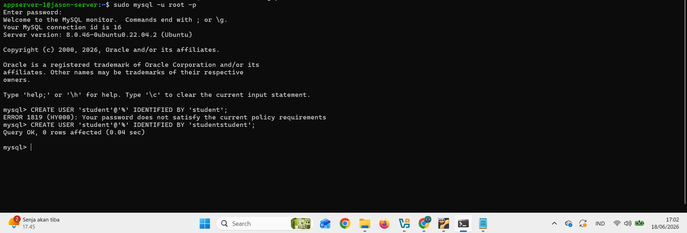{width="4.880208880139983in"
height="1.6464545056867892in"}

STEP 12 : Menambahkan hak akses (previleges) ke user mysql baru

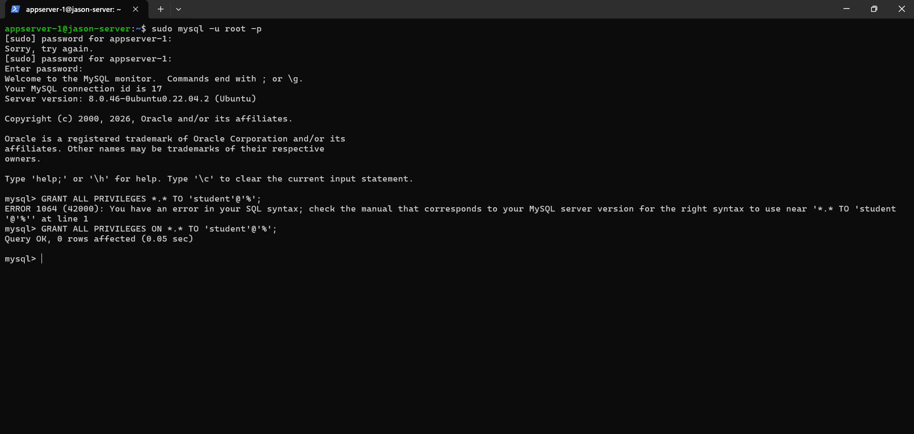{width="4.942708880139983in"
height="2.3351377952755907in"}

STEP 13 : Masuk ke Mysql dengan user baru

{width="4.964049650043744in"
height="2.794261811023622in"}

STEP 14 : Membuat database

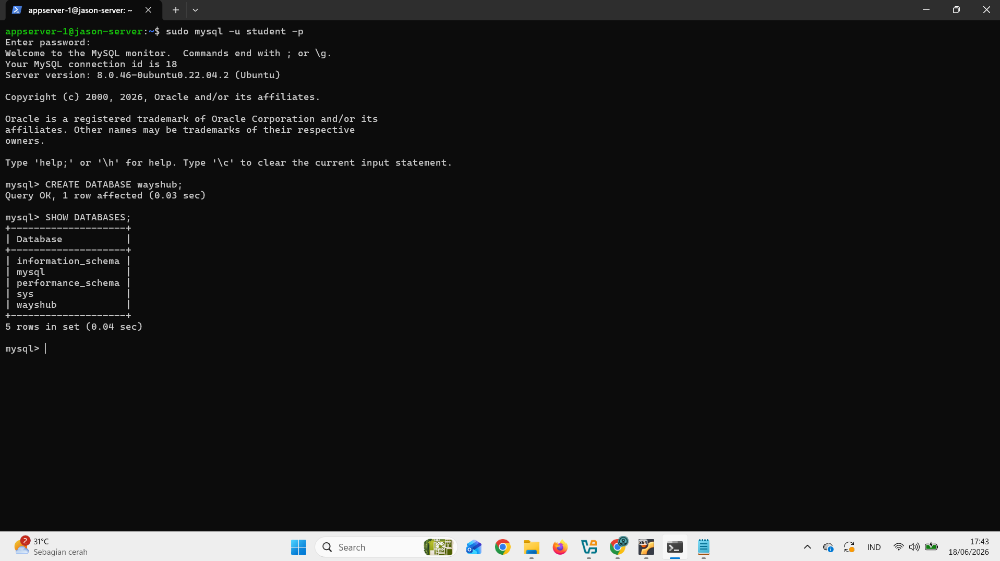{width="4.796875546806649in"
height="2.6976082677165354in"}

STEP 15 : Mengubah bind address pada file
[/etc/mysql/mysql.conf.d/mysqld.cnf]{.mark}

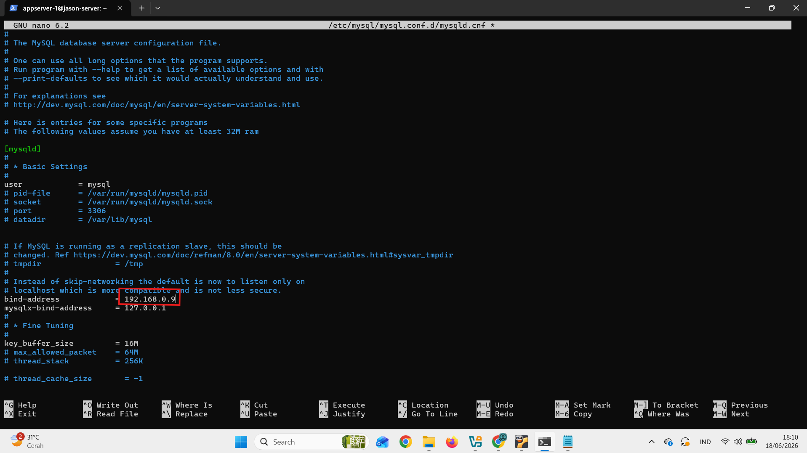{width="4.817708880139983in"
height="2.7124912510936134in"}

2.  **Role Based**

> STEP 1 : Membuat database "demo" dan tabel "transaction"
>
> 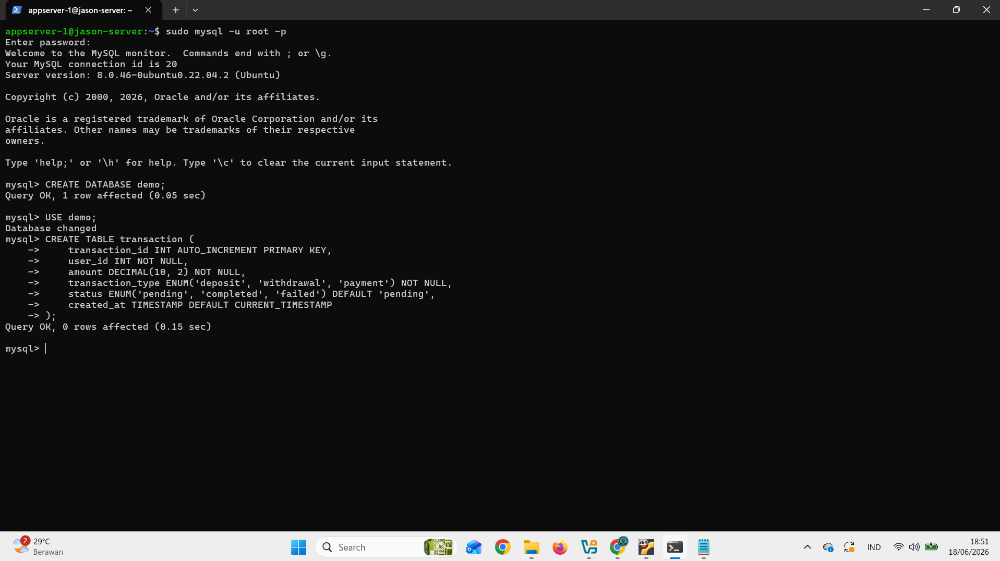{width="4.859375546806649in"
> height="2.7296489501312338in"}
>
> STEP 2 : Membuat role dan hak akses
>
> 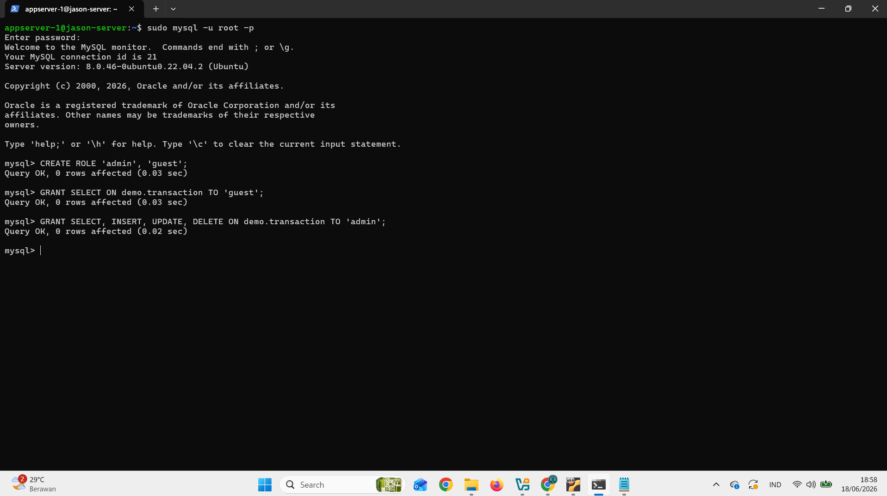{width="4.942708880139983in"
> height="2.7623917322834646in"}
>
> STEP 3 : Membuat user dengan nama Dennis dan role admin
>
> 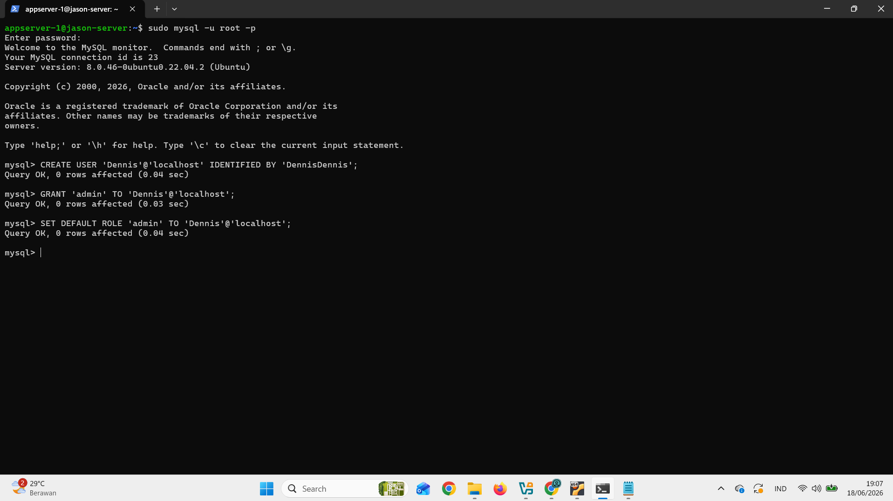{width="4.973958880139983in"
> height="2.8009503499562554in"}
>
> STEP 4 : Membuat user dengan nama guest dan role guest
>
> 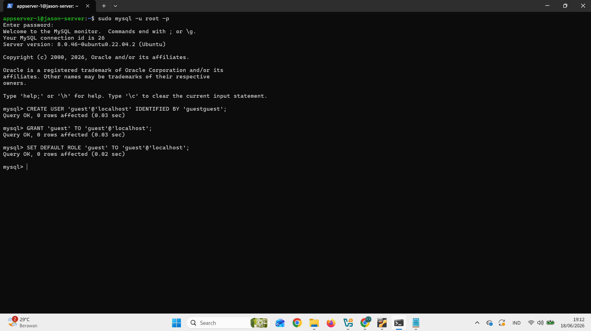{width="5.067708880139983in"
> height="2.846246719160105in"}

STEP 5 : Tes semua user dengan melakukan login

{width="5.057292213473316in"
height="2.8116688538932633in"}

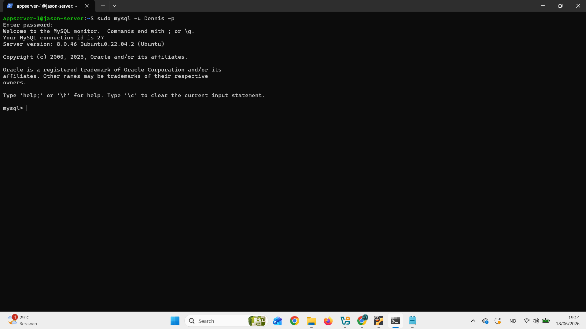{width="5.046875546806649in"
height="2.8382622484689413in"}
