**TASK WEEK 2**

**NAMA : DENNIS JASON**

**KELAS : DEVOPS 27**

\[ Docker \]

-   Buatlah suatu user baru dengan nama **team kalian**

> 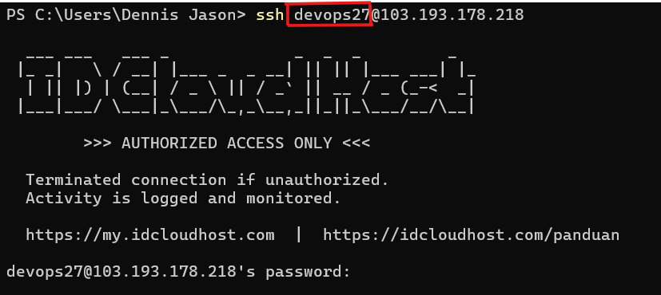{width="3.4843755468066493in" height="1.546636045494313in"}

-   Buatlah bash script se freestyle mungkin untuk melakukan installasi docker.

> 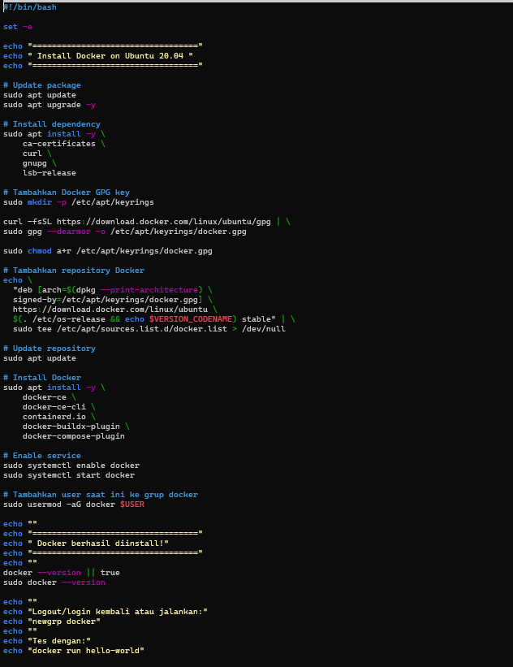{width="4.47444772528434in" height="5.817708880139983in"}

-   Deploy aplikasi Web Server, Frontend, Backend, serta Database on top docker compose

-   Ketentuan buatlah environment yaitu (production)

    -   Ketentuan di Production

        -   Deploy database di server terpisah

> 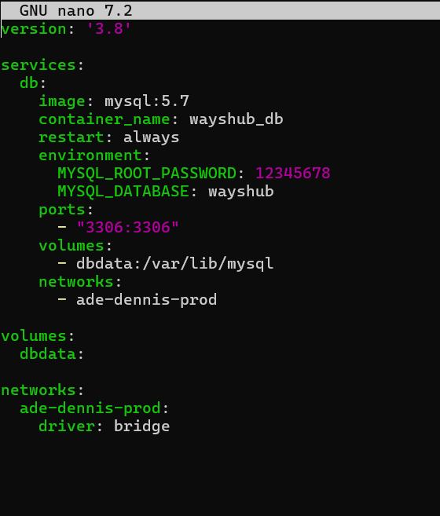{width="2.244792213473316in" height="2.631606517935258in"}
>
> 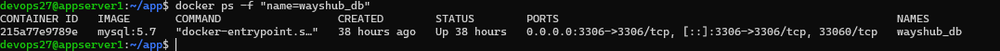{width="4.890625546806649in" height="0.25184273840769905in"}

-   Server Backend terpisah dengan 2 container di dalamnya

> 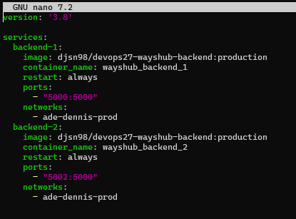{width="2.4843755468066493in" height="1.8378390201224848in"}
>
> 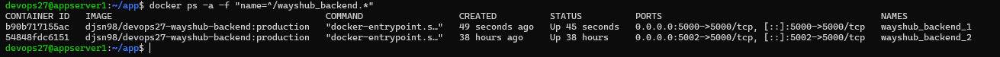{width="5.067708880139983in" height="0.2946347331583552in"}

-   Server Frontend terpisah dengan 2 container di dalamnya

> 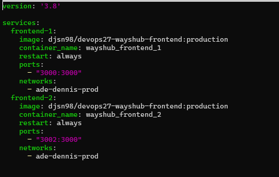{width="2.9843755468066493in" height="1.8968482064741907in"}
>
> 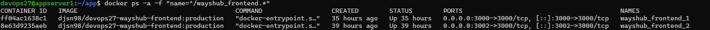{width="5.026042213473316in" height="0.2253827646544182in"}

-   Web Server juga terpisah untuk reverse proxy kalian nantinya.

> 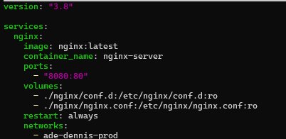{width="3.276042213473316in" height="1.597273622047244in"}
>
> 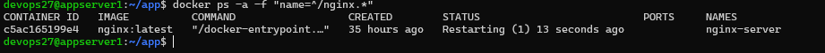{width="5.109375546806649in" height="0.3310061242344707in"}

-   Untuk penamaan image, sesuaikan dengan environment masing masing, ex: team1/dumbflx/frontend:production

> 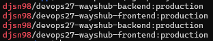{width="3.25in" height="0.625in"}

-   Untuk building image frontend dan backend sebisa mungkin buat dockerized

> dengan image sekecil mungkin(gunakan multistage build). dan jangan lupa untuk sesuaikan configuration dari backend ke database maupun frontend ke backend sebelum di build menjadi docker images.

1.  Arahkan frontend ke ip backend pada bagian baseURL

> 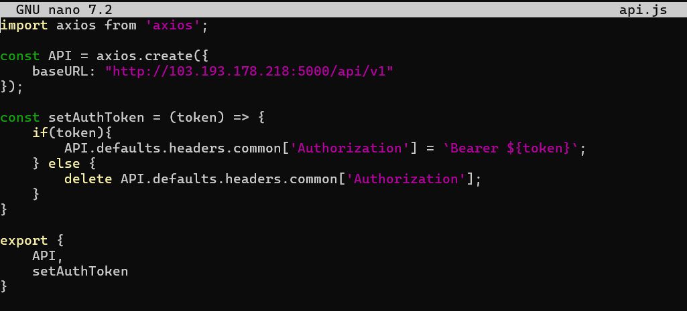{width="3.8281255468066493in" height="1.7267672790901136in"}

2.  Isi credential database pada backend

> 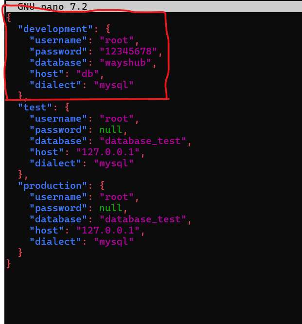{width="2.5907392825896762in" height="2.752659667541557in"}

-   Untuk Web Server buatlah configurasi reverse-proxy menggunakan nginx on top docker.

> 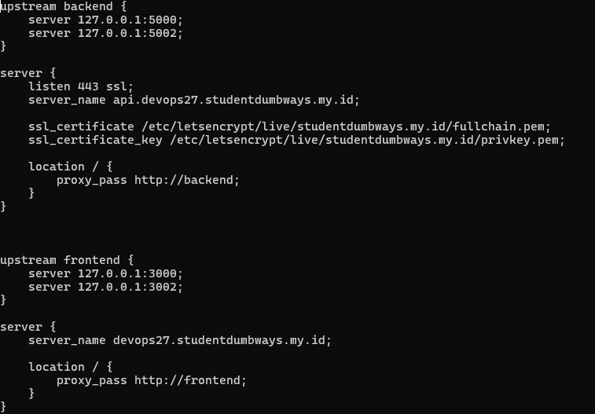{width="5.411458880139983in" height="3.766446850393701in"}

-   **SSL CLOUDFLARE OFF!!!**

> 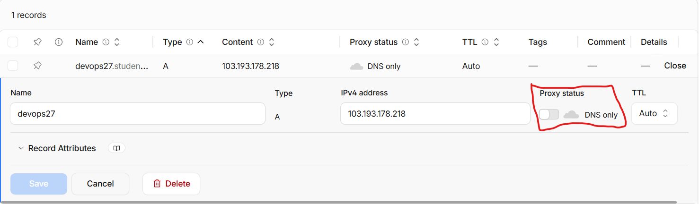{width="5.526042213473316in" height="1.6155872703412073in"}

-   Gunakan docker volume untuk membuat reverse proxy

> 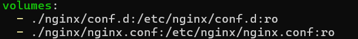{width="5.692708880139983in" height="0.6335739282589676in"}

-   SSL gunakan wildcard

> 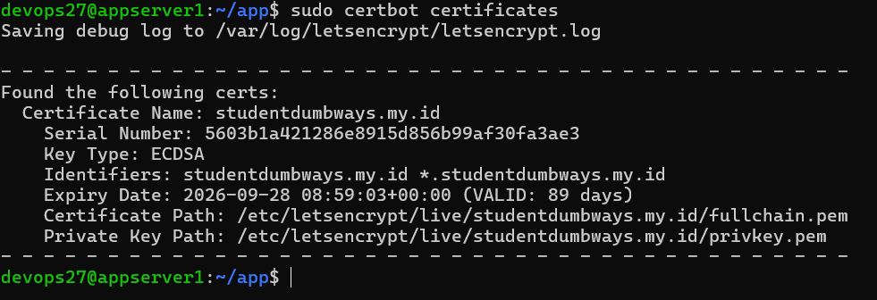{width="5.640625546806649in" height="1.9395505249343832in"}

-   Untuk DNS bisa sesuaikan seperti contoh di bawah ini

    -   Production

        -   Frontend: [[team1.studentdumbways.my.id]{.underline}](http://team1.studentdumbways.my.id/)

> 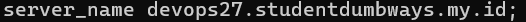{width="5.046875546806649in" height="0.21108595800524935in"}

-   Backend: [[api.team1.studentdumbways.my.id]{.underline}](http://api.team1.studentdumbways.my.id/)

> 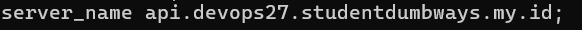{width="5.046875546806649in" height="0.26087270341207347in"}

-   Push image ke docker registry kalian masing\".

> 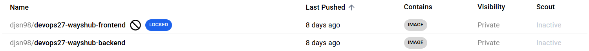{width="5.890625546806649in" height="0.5186100174978128in"}

-   Aplikasi dapat berjalan dengan sesuai seperti melakukan login/register.

```{=html}
<!-- -->
```
-   Register

> 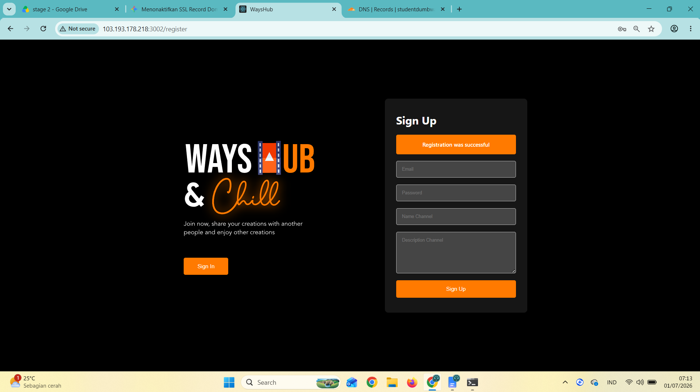{width="4.490071084864392in" height="2.5162182852143484in"}

-   Login

> 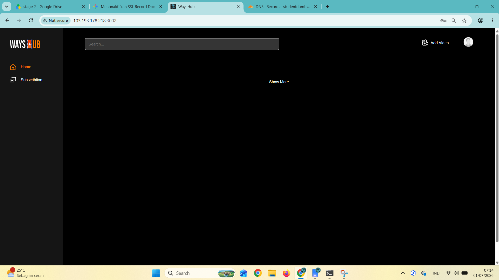{width="4.677571084864392in" height="2.6264938757655294in"}

\[ Jenkins \]

-   Installasi Jenkins on top Docker or native

> 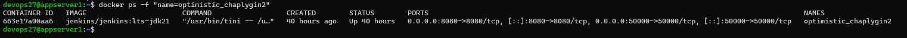{width="6.267716535433071in" height="0.2638888888888889in"}

-   Setup SSH-KEY di local server jenkins kalian, agar dapat login ke dalam

> server menggunakan SSH-KEY

-   Copy public key yang sudah di generate yang terdapat di c://Users/\[nama user pc\]/.ssh

> 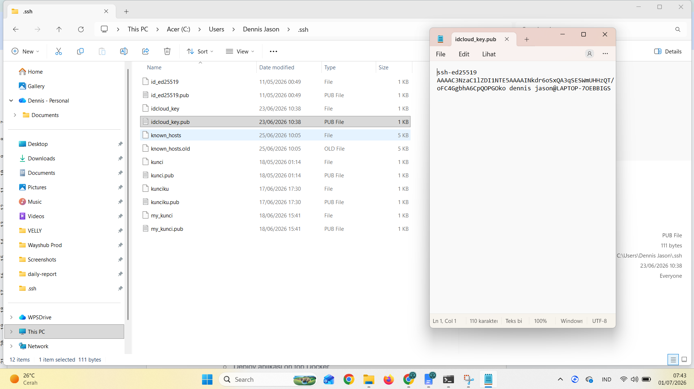{width="4.953125546806649in" height="2.7907534995625545in"}

-   Paste di .ssh/authorized_keys

> 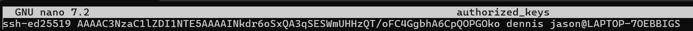{width="5.119792213473316in" height="0.23812992125984253in"}

-   Ssh dengan public key tanpa password

> 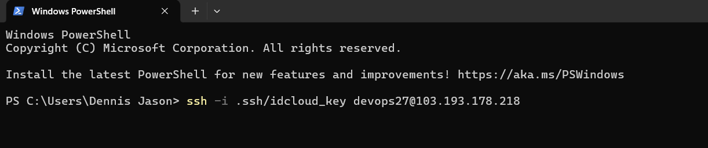{width="4.473958880139983in" height="0.9438418635170603in"}

-   Buatlah beberapa Job untuk aplikasi kalian yang telah kalian deploy di task sebelumnya (production)

-   Untuk script CICD atur flow pengupdate an aplikasi se freestyle kalian dan harus mencangkup

    -   Pull dari repository

    -   Dockerize/Build aplikasi kita

    -   Test application

    -   Push ke Docker Hub

    -   Deploy aplikasi on top Docker

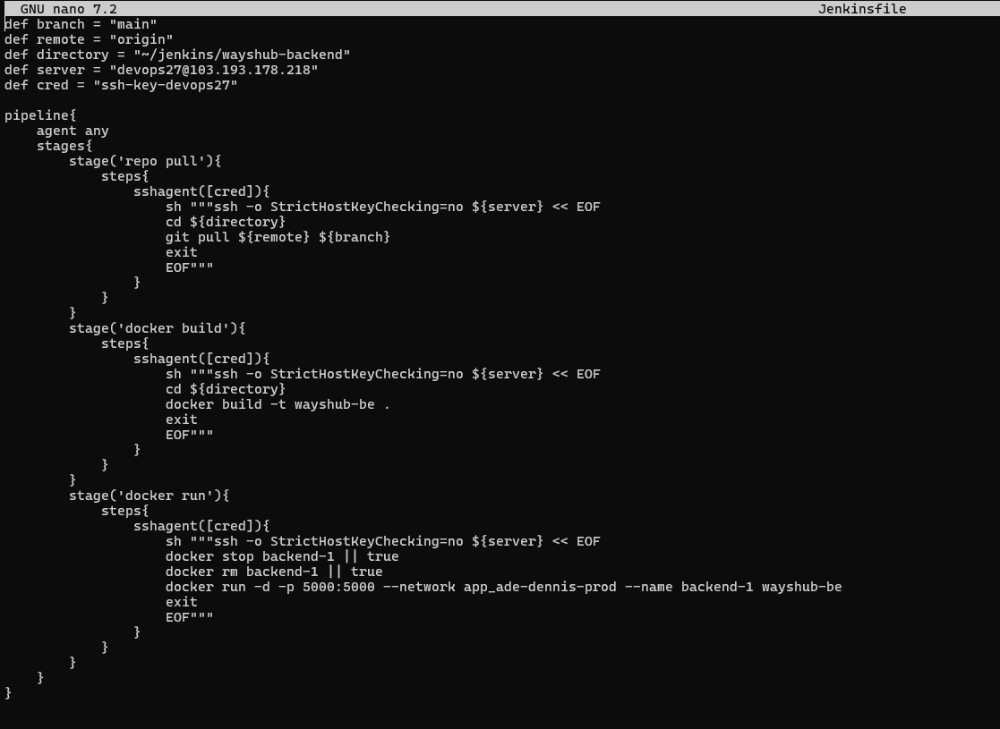{width="5.076517935258093in" height="3.693847331583552in"}

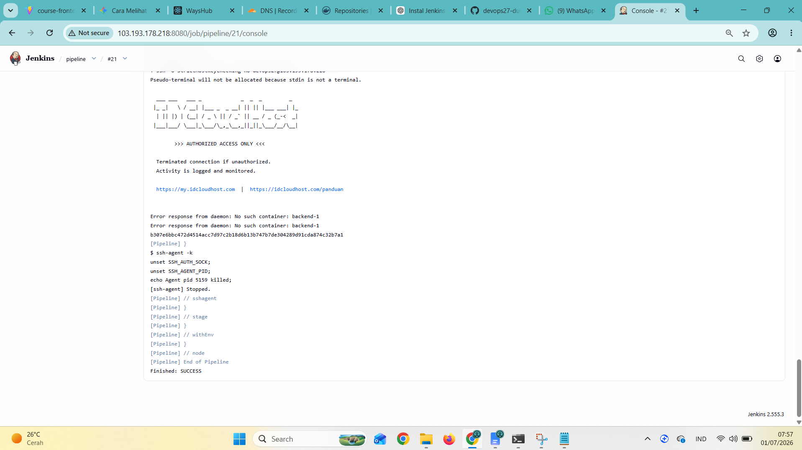{width="4.95759842519685in" height="2.7968755468066493in"}

-   Auto trigger setiap ada perubahan di SCM

> 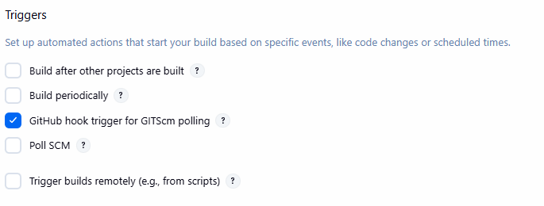{width="5.640625546806649in" height="2.1363167104111986in"}
>
> 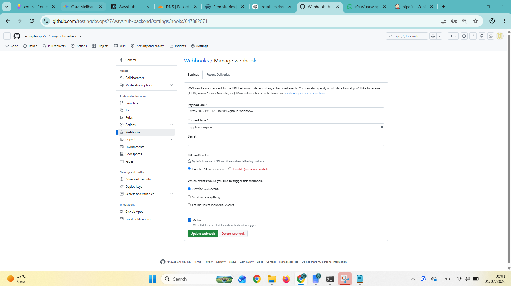{width="5.526042213473316in" height="3.1118405511811025in"}
